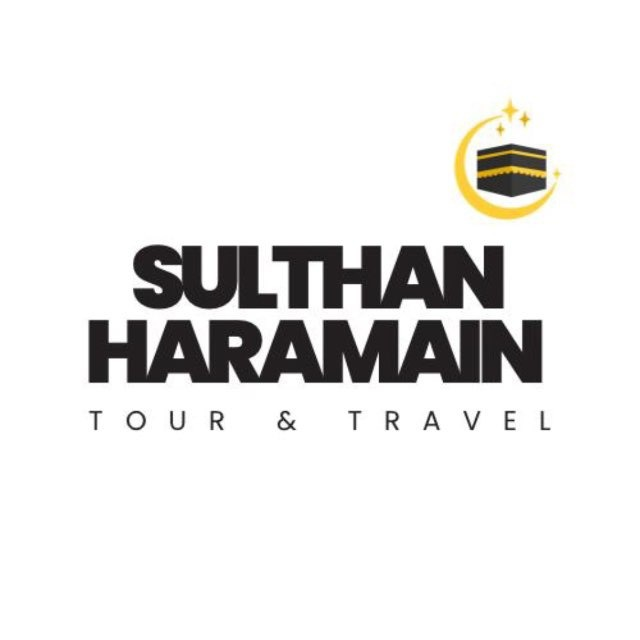

# 🕋 SULTHAN HARAMAIN — Sistem Operasional & ERP Travel Umroh Terpadu

<p align="center">
  
</p>

<p align="center">
  <strong>PT BAROKAH SULTHAN HARAMAIN</strong><br/>
  <em>Keputusan Menteri Hukum Republik Indonesia NOMOR AHU-0007388.AH.01.01.TAHUN 2026</em><br/>
  <em>NO. IZIN PPIU : 25052200384080005 • NIB: 1504260072814</em><br/>
  Jl. Pahlawan No.10 J, Ps. Gambir, Kec. Tebing Tinggi Kota, Kota Tebing Tinggi, Sumatera Utara 20631<br/>
  Telp / WhatsApp: 0821-6733-9464 • Email: barokahsulthanharamain@gmail.com
</p>

---

## 📖 Tentang Aplikasi

**SULTHAN HARAMAIN ERP & CRM** adalah platform enterprise modern berbasis web dan aplikasi mobile native yang dirancang khusus untuk mengelola seluruh ekosistem bisnis biro perjalanan ibadah Umroh dan Haji Khusus secara menyeluruh, efisien, aman, dan patuh terhadap regulasi **Kementerian Agama Republik Indonesia (SISKOPATUH)** serta **Kementerian Haji dan Umrah Kerajaan Arab Saudi**.

Sistem ini menghubungkan seluruh pihak dalam satu database terpusat (*Single Source of Truth*):
* 🏢 **Manajemen Kantor Pusat & Cabang**
* 👥 **Staf Operasional, Marketing & Keuangan**
* 🚩 **Tour Leader & Muthawwif di Arab Saudi**
* 🤝 **Jaringan Mitra & Agen Lapangan**
* 📱 **Calon Jamaah & Jamaah Aktif di Tanah Suci (Mobile Portal & Android APK)**

---

## 🌟 Fitur Utama & Modul Sistem

### 1. 🎯 Marketing CRM & Pipeline Calon Jamaah (Tier 1 & 2)
* **Manajemen Lead Multichannel**: Pencatatan calon jamaah dari Instagram, TikTok, Website, Referral Alumni, Agen Cabang, atau Walk-In.
* **Pipeline Prospek 5 Tahap**: *Lead Baru ➡️ Dihubungi ➡️ Tertarik ➡️ Penawaran Terkirim ➡️ Closing DP*.
* **Playbook & SOP Closing Sales**: Skrip edukasi penanganan keberatan calon jamaah (harga, keraguan travel, fasilitas lansia, dll).
* **Konversi 1-Klik ke Jamaah Resmi**: Memindahkan data prospek langsung ke Database Jamaah (Tier 3), otomatis menerbitkan Invoice Tagihan DP, dan menyiapkan berkas persyaratan.

### 2. 👥 Database Calon Jamaah & Manifest Keberangkatan (Tier 3)
* **Master Identitas Lengkap**: NIK KTP, No. Paspor, Tempat & Tanggal Lahir, Golongan Darah, Mahram & Hubungan Keluarga, Kontak Darurat, dan Catatan Riwayat Kesehatan.
* **Sistem Peringatan Masa Berlaku Paspor Pintar**:
  * ⛔ **Merah**: *Kadaluarsa / Expired*
  * ⛔ **Merah Kedip**: *Expired < 6 Bulan (Wajib Perpanjang untuk Visa Umroh)*
  * ⚠️ **Kuning**: *Saran Perpanjang (< 1 Tahun)*
  * ✅ **Hijau**: *Aktif (> 1 Tahun)*
* **Manifes Kamar & Seragam**: Alokasi paket keberangkatan, tipe kamar (*Quad, Triple, Double*), dan ukuran seragam batik (*S, M, L, XL, XXL, XXXL*).
* **Export Data**: Ekspor manifest jamaah ke format CSV/Excel untuk maskapai dan provider visa.

### 3. 🗓️ Manajemen Itinerary Terpadu Hari-demi-Hari (Day-by-Day)
* **Preset Template Standar Industri**:
  * ✨ *Preset 9 Hari (Madinah ➡️ Makkah ➡️ Kepulangan)*
  * ✨ *Preset 12 Hari (+ Ziarah Thaif & Kereta Cepat Haramain High Speed Rail)*
* **Rincian Per Hari Lengkap**:
  * ⏰ Waktu/Jam Kumpul (WSA / WIB)
  * 📍 Titik Kumpul (Lobby Hotel / Gate Masjid)
  * 👔 Ketentuan Pakaian / Dresscode (Batik Travel / Kain Ihram / Bebas Syar'i)
  * 🍽️ Rencana Makan (Fullboard Hotel)
  * 📝 Rincian Ibadah & Ziarah Napak Tilas
  * 💡 Tips Muthawwif untuk Jamaah
* **Multisaluran**:
  * 📱 **Mobile App Jamaah**: Tampil interaktif dengan penanda otomatis **`📍 HARI INI: HARI KE-X`**.
  * 💬 **1-Klik Salin WhatsApp**: Format rundown rapi lengkap dengan emoji untuk broadcast rombongan.
  * 🖨️ **Cetak Brosur PDF**: Ber-Kop Surat resmi PPIU untuk penawaran korporat / keluarga.

### 4. 📄 Generator Surat Resmi PPIU Ber-Kop Surat Standar
* **Kop Surat 5 Baris Standar Legal**:
  1. *Nama Perusahaan (PT BAROKAH SULTHAN HARAMAIN)*
  2. *Alamat Lengkap Kantor Pusat*
  3. *Nomor WhatsApp Resmi & Email*
  4. *Keputusan Menteri Hukum RI NOMOR AHU-0007388.AH.01.01.TAHUN 2026*
  5. *Nomor Izin PPIU : 25052200384080005*
* **Dokumen Siap Cetak / PDF**:
  * 📑 **Surat Rekomendasi Pembuatan / Penggantian Paspor** (ke Kantor Imigrasi).
  * 📑 **Surat Izin / Cuti Ibadah Umroh** (ke Perusahaan / Instansi / Kampus / Sekolah).
  * 📑 **Surat Rekomendasi Kemenag Kab/Kota**.
  * 📑 **Surat Keterangan Terdaftar Calon Jamaah**.
* **Lampiran Legalitas Otomatis**: Opsi menyertakan 3 lembar lampiran salinan SK Kemenkumham & NIB Berbasis Risiko.

### 5. 💳 Keuangan, Invoicing & Kwitansi Resmi
* **Invoicing Terpadu**: Tagihan DP, Cicilan Bertahap, dan Pelunasan Paket Umroh.
* **Kwitansi Resmi Berstempel**:
  * Format baris *Uang Sejumlah* dengan nominal dan narasi terbilang rupiah:  
    👉 **`Rp. 5.000.000,- (Lima Juta Rupiah)`**
  * Kota penandatanganan resmi (*Tebing Tinggi*).
* **Laporan Laba Rugi Komprehensif (Income Statement)**:
  * Pendapatan usaha riil, Beban Pokok Penjualan (HPP Hotel, Tiket Pesawat, Visa, Handling), Laba Kotor, Biaya Operasional, dan Laba Bersih.
* **Buku Jurnal Umum**: Pencatatan debit/kredit akuntansi berstandar PSAK.

### 6. 📦 Inventaris Logistik & BAST Tanda Tangan Digital
* **Manajemen Stok Gudang**: Koper Besar 24", Koper Kecil Kabin, Tas Serut/Sandal, Kain Ihram, Mukena, Bahan Batik, Buku Doa, Gelang Identitas.
* **Peringatan Stok Menipis (Low Stock Alert)**.
* **Berita Acara Serah Terima (BAST)**: Formulir serah terima barang per jamaah dilengkapi **Canvas Tanda Tangan Digital (Signature Pad)** di layar smartphone/laptop.

### 7. 🛡️ Standar Kepatuhan Kemenag RI & SISKOPATUH
* **Tabel Manifest Standar SISKOPATUH**: Format kolom baku Kemenag RI (NIK, No. Paspor, Nama Ayah Kandung, Nama Mahram, Status Vaksin Meningitis ICV, Status Visa).
* **Kartu Digital ID Card QR SISKOPATUH**: QR Code berisi identitas jamaah, hotel, kontak darurat travel, dan nomor izin PPIU.
* **Checklist Dokumen Perjalanan**: Verifikasi paspor fisik, visa e-Umrah, sertifikat meningitis, dan buku nikah/akta lahir.

### 8. 🚩 Ground Handling & Operasional Saudi
* **Manajemen Pembagian Kamar Hotel (Rooming List)**: Pengelompokan jamaah per kamar di Makkah & Madinah.
* **Manifest Bus & Transportasi**: Alokasi seat bus antar jemput bandara, miqat, dan ziarah kota.
* **Absensi Harian Saudi**: Pemantauan kehadiran jamaah pada setiap agenda ibadah bersama.

### 9. 📱 Aplikasi Mobile Jamaah (Android Native APK & PWA)
* **Tampilan Khusus Smartphone Jamaah**:
  * 🕋 **Itinerary & Timeline**: Jadwal kegiatan harian dengan deteksi hari-H otomatis.
  * 📖 **Doa & Audio Manasik**: Pemutar audio talbiyah, niat ihram, doa tawaf, sa'i, dan tahallul dengan teks Arab, Latin, dan Terjemahan Indonesia.
  * 🪪 **Digital ID Card QR**: Gelang identitas digital resmi PPIU.
  * 💳 **Kwitansi & Tagihan**: Riwayat bukti pembayaran DP dan pelunasan.
  * 🚨 **Tombol Darurat SOS**: 1-klik mengirimkan pesan darurat WhatsApp beserta identitas dan lokasi hotel ke Muthawwif/Tour Leader jika terpisah dari rombongan.

### 10. 🤝 Manajemen Cabang, Mitra & Komisi Referral
* **Manajemen Kantor Cabang & Agen Lapangan**.
* **Perhitungan Komisi Otomatis**: Komisi Agen (Rp 1.500.000/pax) dan Komisi Referral Alumni (Rp 500.000/pax).
* **Pengajuan & Pencairan Komisi (Payouts)**: Terintegrasi dengan jurnal kas keluar.

---

## 🛠️ Arsitektur Teknologi

* **Frontend & Backend**: [Next.js 14](https://nextjs.org/) (App Router, Server Actions & REST API)
* **Bahasa**: [TypeScript](https://www.typescriptlang.org/)
* **Database & ORM**: [SQLite](https://www.sqlite.org/) + [Prisma ORM](https://www.prisma.io/) (Portabel & Zero-Config, siap beralih ke PostgreSQL/MySQL)
* **Styling & UI**: [Tailwind CSS](https://tailwindcss.com/) + [Lucide Icons](https://lucide.dev/)
* **Mobile Engine**: [Capacitor](https://capacitorjs.com/) (Android Native App ID: `com.sulthanharamain.app`) + PWA Web Manifest
* **Process Manager Production**: [PM2](https://pm2.keymetrics.io/)
* **Web Server**: [Nginx](https://nginx.org/) Reverse Proxy

---

## 🚀 Panduan Menjalankan di Lingkungan Lokal (Local Development)

### 1. Prasyarat
* Node.js v18+ atau v20+
* npm atau yarn

### 2. Instalasi Dependensi
```bash
npm install
```

### 3. Konfigurasi Environment (`.env`)
Pastikan file `.env` berisi:
```env
DATABASE_URL="file:./dev.db"
PORT=3005
```

### 4. Sinkronisasi Database
```bash
npx prisma db push
```

### 5. Jalankan Server Pengembang
```bash
npm run dev
# atau menentukan port spesifik:
npx next dev -p 3005
```
Akses aplikasi melalui browser di: **`http://localhost:3005`**

---

## 📱 Panduan Build Android APK

Proyek ini telah dilengkapi dengan Capacitor Android Native:

```bash
# 1. Build aplikasi Next.js & sinkronisasi aset ke folder Android
npm run build:apk

# 2. Buka proyek di Android Studio untuk generate Release APK / AAB
npx cap open android
```
File konfigurasi Capacitor berada di `capacitor.config.ts` dan folder native di `android/`.

---

## 🌐 Panduan Deployment ke VPS Hostinger

Panduan lengkap, langkah demi langkah, dan skrip otomatisasi deployment ke Hostinger VPS telah didokumentasikan secara rinci di:
👉 **[`PANDUAN_DEPLOY_HOSTINGER.md`](./PANDUAN_DEPLOY_HOSTINGER.md)**

### File Pendukung Deployment yang Tersedia:
* `ecosystem.config.js` — Konfigurasi PM2 Cluster di server.
* `hostinger-nginx.conf` — Konfigurasi reverse proxy Nginx untuk domain `portalumroh.barokahgroupindonesia.tech`.
* `deploy.sh` — Skrip update 1-perintah (`git pull`, `npm run build`, `pm2 reload`).

---

## 🔐 Kebijakan Mutlak Sistem: Bebas Data Palsu (Zero-Mock Data Policy)

Sistem ini menerapkan kebijakan ketat **Zero-Mock Data Policy** (`AGENTS.md` & `GEMINI.md`):
1. **Dilarang Keras Menggunakan Data Mock/Dummy**: Tidak ada data rekaan, nama contoh, atau simulasi fiktif.
2. **Clean Empty States**: Jika database kosong, tampilan antarmuka menampilkan state kosong yang bersih dan profesional.
3. **Database Murni**: Seluruh data yang tampil adalah data asli yang diinputkan secara sadar oleh pengguna dan staf.

---

## 📞 Kontak & Dukungan Resmi

**PT BAROKAH SULTHAN HARAMAIN**  
*Biro Perjalanan Wisata, Umroh & Haji Khusus*  
* 📍 **Alamat**: Jl. Pahlawan No.10 J, Ps. Gambir, Kec. Tebing Tinggi Kota, Kota Tebing Tinggi, Sumatera Utara 20631
* 📱 **WhatsApp / Telepon**: [0821-6733-9464](https://wa.me/6282167339464)
* ✉️ **Email**: barokahsulthanharamain@gmail.com
* 🌐 **Website / Portal**: [portalumroh.barokahgroupindonesia.tech](https://portalumroh.barokahgroupindonesia.tech)
* 👑 **Superadmin & Penanggung Jawab**: Coach Argun (`@master`)

---
<p align="center">
  <em>Semoga Allah SWT senantiasa memberikan keberkahan, kemudahan, dan kelancaran dalam melayani para tamu Allah ke Baitullah. Aamiin Ya Rabbal 'Alamin. 🤲</em>
</p>
